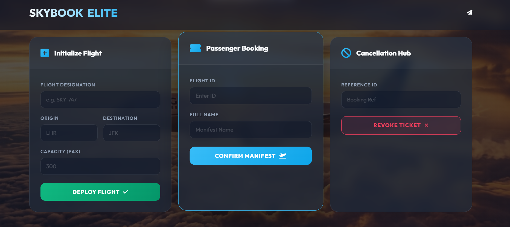
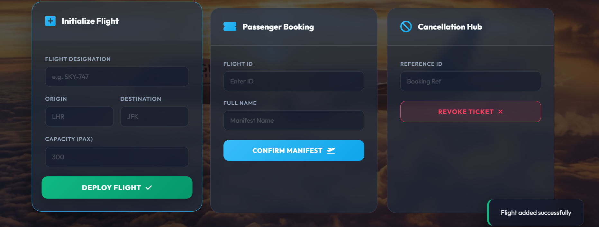
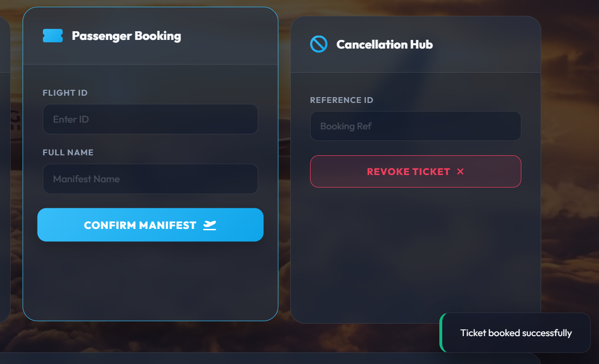
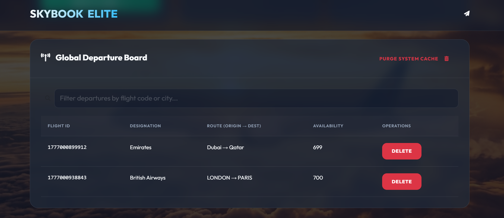
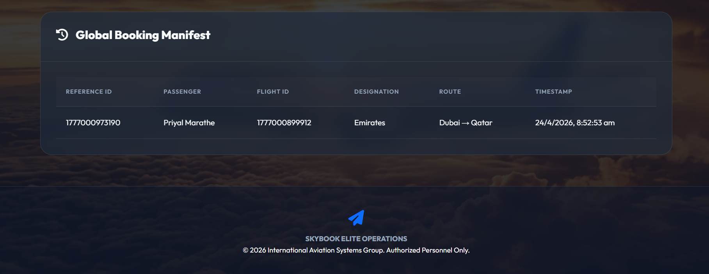
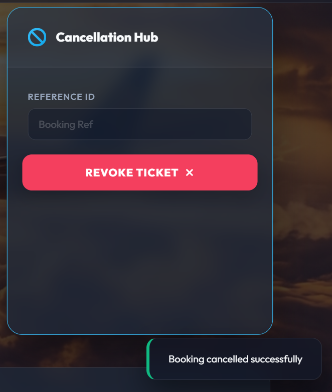
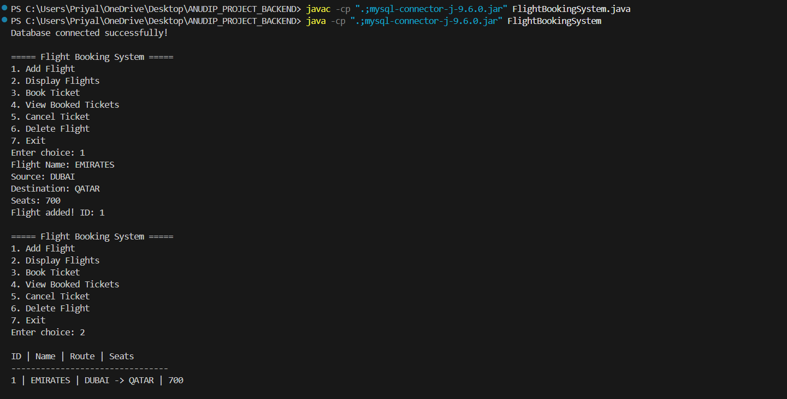
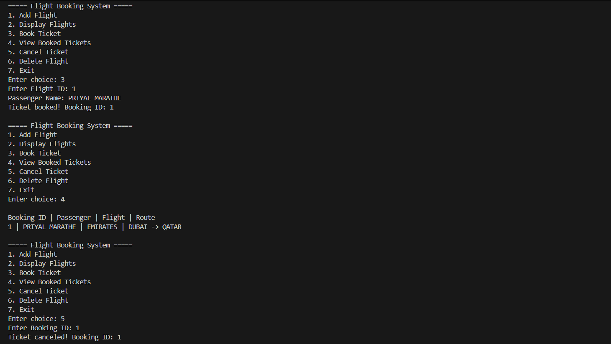
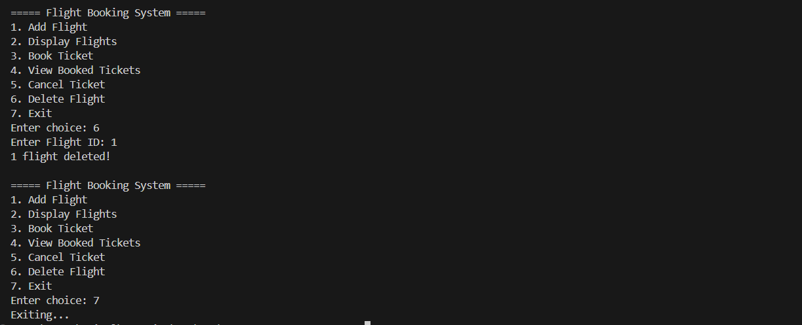

# Priyal_Anudip_SprintProjects
A curated collection of sprint projects developed during Anudip training, featuring a responsive frontend built with HTML, CSS, JavaScript, and Bootstrap, along with a standalone Java backend JAR application. The backend demonstrates core Java concepts including Collections Framework, File Handling, Exception Handling, JDBC, and Stream API, reflecting practical implementation of full-stack development skills.

# Flight Booking System – Sprint Project Collection

A curated set of sprint-based projects developed during Anudip training.  
This repository contains two independent modules:
- Frontend Website Project (UI)
- Backend Java Project (JDBC + Core Java Concepts)

---

# Frontend Project (UI Module)

## Overview
A responsive flight booking interface built using:
- HTML
- CSS
- JavaScript
- Bootstrap

It focuses on UI design, layout structuring, and basic interaction flow.

---

## Frontend Screenshots

  
  
  
  
  
  

---

# Backend Project (Java + JDBC Module)

## Overview
A console-based Java application integrated with MySQL using JDBC.

It demonstrates core Java concepts such as:
- Collections Framework
- File Handling
- Exception Handling
- Stream API
- JDBC Connectivity

---

## Backend Screenshots

  
  

---

# Database

- Database: MySQL
- Name: `flightdb2`
- Tables:
  - flights
  - bookings

---

# Features

## Frontend
- Responsive UI using Bootstrap
- Clean layout structure
- User interaction screens

## Backend
- Add / Display Flights
- Book Tickets with Booking ID generation
- View Booked Tickets
- Cancel Tickets
- Delete Flights
- File logging system
- JDBC database integration

---

# Tech Stack

- Frontend: HTML, CSS, JavaScript, Bootstrap
- Backend: Java (Core + JDBC)
- Database: MySQL

---

# Project Type
Independent sprint-based modules demonstrating frontend UI development and backend Java programming with database integration.
